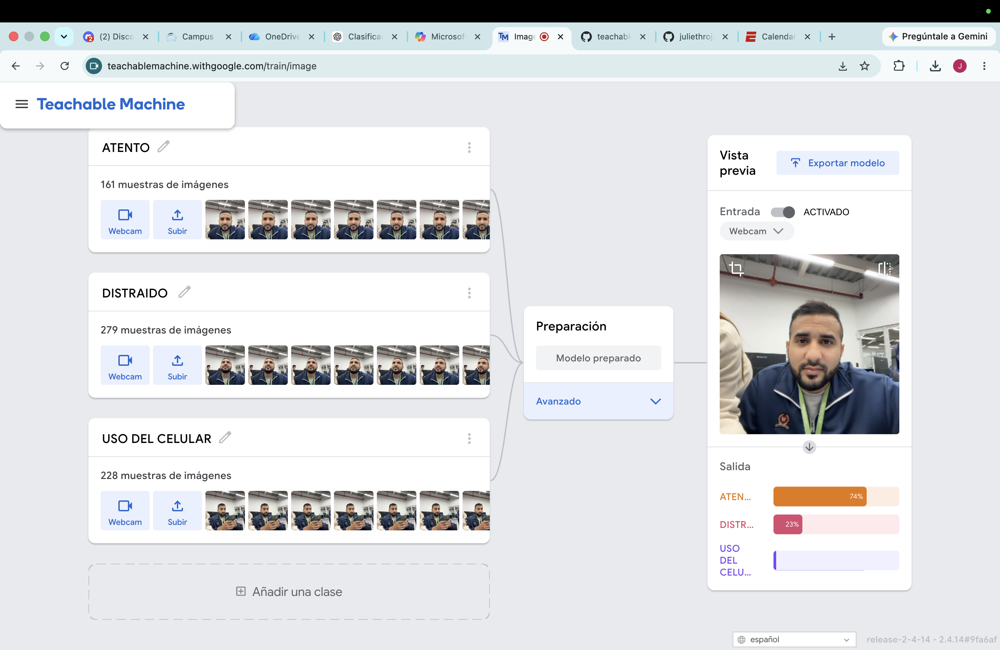
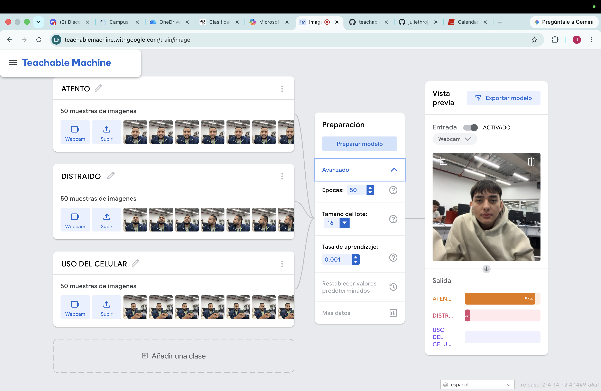
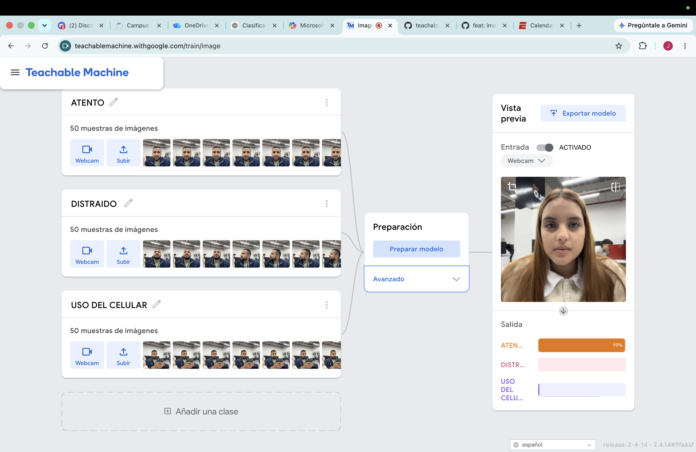
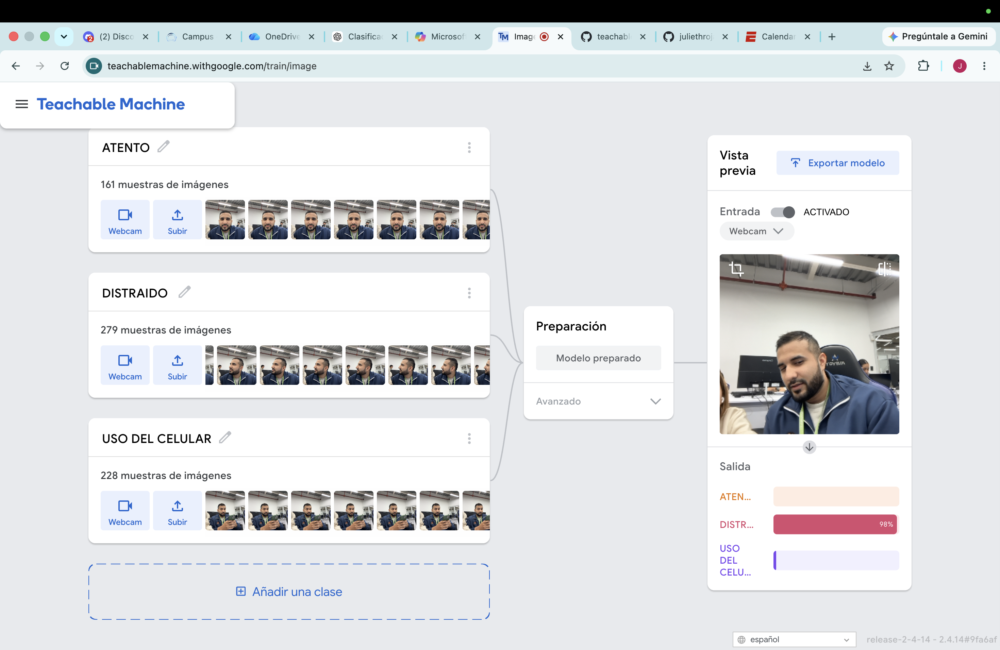
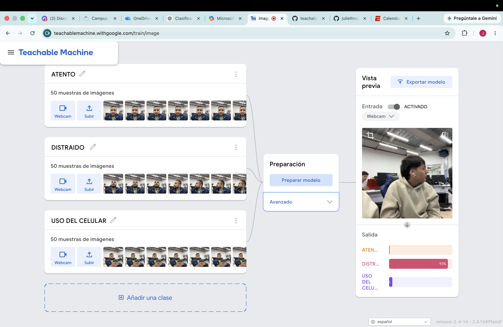
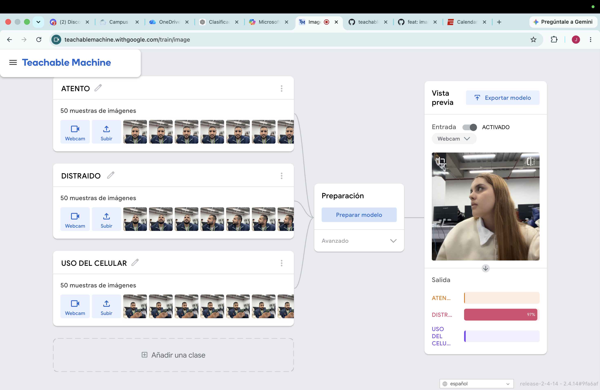
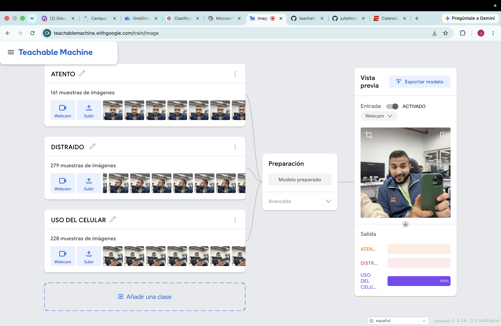
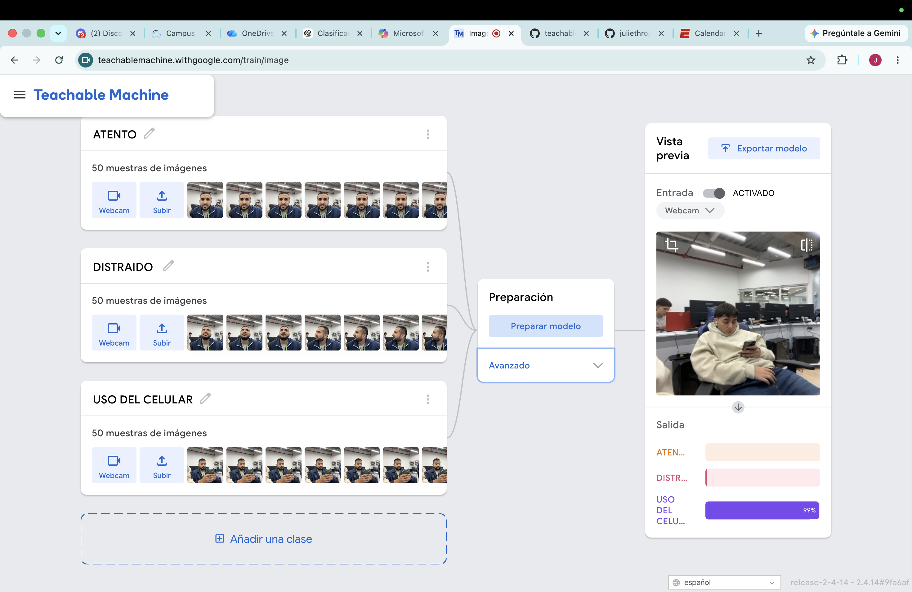
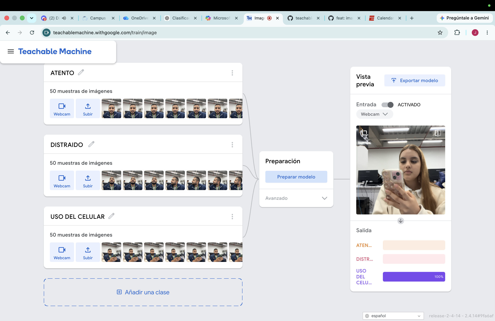

# SISTEMA-INTELIGENTE
# Sistema Inteligente de Clasificación del Nivel de Atención de un Estudiante
### Proyecto de Redes Neuronales y Clasificación con Teachable Machine

Inteligencia Artificial  
Redes Neuronales y Clasificación con Teachable Machine  

---

# Descripción del Proyecto

Este proyecto consiste en el diseño, entrenamiento y análisis de un modelo de Inteligencia Artificial capaz de clasificar el nivel de atención de un estudiante utilizando imágenes capturadas mediante una cámara web.

El sistema fue desarrollado con **Google Teachable Machine**, una plataforma de aprendizaje automático que permite entrenar modelos de clasificación de imágenes mediante redes neuronales sin necesidad de construir la arquitectura desde cero.

El modelo analiza continuamente las imágenes provenientes de la webcam y determina si el estudiante se encuentra:

- Atento
- Distraído
- Usando el celular

La clasificación se realiza en tiempo real calculando la probabilidad de pertenecer a cada una de las clases entrenadas y mostrando como resultado aquella que posee la mayor confianza.

Este proyecto busca demostrar cómo la Inteligencia Artificial puede automatizar tareas sencillas mediante reconocimiento visual, aplicando conceptos fundamentales como redes neuronales, clasificación, probabilidades, reconocimiento de patrones y Forward Pass.

---

# Objetivo General

Diseñar, entrenar y analizar un modelo de clasificación de imágenes utilizando Teachable Machine para identificar automáticamente el nivel de atención de un estudiante mediante una cámara web, comprendiendo el funcionamiento de las redes neuronales y su aplicación en problemas reales.

---

# Problema a Resolver

En los entornos educativos actuales, especialmente en clases virtuales o espacios de aprendizaje autónomo, resulta difícil supervisar constantemente el nivel de atención de los estudiantes.

Normalmente esta tarea depende de la observación del docente, quien debe dividir su atención entre la explicación del contenido, la interacción con los estudiantes y el seguimiento del grupo completo. Debido a ello, muchas distracciones pasan desapercibidas y pueden afectar el proceso de aprendizaje.

Entre las principales causas de pérdida de atención se encuentran:

- Uso del teléfono celular.
- Mirar hacia otro lugar.
- Conversar con otras personas.
- Falta de concentración durante la actividad.

Realizar este seguimiento manualmente no siempre es posible, especialmente cuando existen muchos estudiantes.

La Inteligencia Artificial ofrece una solución mediante modelos capaces de analizar imágenes y reconocer automáticamente determinados comportamientos.

Este proyecto propone utilizar una red neuronal entrenada con Teachable Machine para clasificar el comportamiento del estudiante y determinar su nivel de atención de manera automática.

---

# ¿Cómo ayuda la Inteligencia Artificial?

La Inteligencia Artificial permite automatizar procesos de reconocimiento visual utilizando modelos de Machine Learning entrenados con ejemplos.

En este proyecto, la IA recibe imágenes provenientes de una webcam y aprende a reconocer patrones visuales presentes en cada comportamiento.

Una vez entrenado, el modelo puede identificar automáticamente el estado del estudiante sin necesidad de intervención humana.

Esto permite:

- Automatizar la clasificación.
- Reducir errores de observación.
- Obtener resultados en tiempo real.
- Apoyar procesos educativos.
- Comprender el funcionamiento práctico del aprendizaje automático.

---

# Clases Utilizadas

El modelo fue entrenado con tres clases diferentes.

##  Clase 1 — Atento

Representa a un estudiante que mantiene la concentración durante la clase.

Características aprendidas:

- Rostro completamente visible.
- Mirada dirigida hacia la pantalla.
- Cabeza orientada al frente.
- Postura estable.
- Ausencia de elementos distractores.

Esta clase representa el comportamiento esperado durante una sesión de aprendizaje.




##  Clase 2 — Distraído

Corresponde a un estudiante que no presta atención a la actividad.

Características aprendidas:

- Mirada hacia los lados.
- Cabeza girada.
- Rostro parcialmente fuera del encuadre.
- Cambios frecuentes de postura.

Esta categoría permite detectar momentos donde disminuye la concentración.





##  Clase 3 — Usando el celular

Representa al estudiante que utiliza un teléfono móvil durante la actividad académica.

Características aprendidas:

- Presencia del teléfono celular.
- Mirada dirigida al dispositivo.
- Cabeza inclinada hacia abajo.
- Manos sosteniendo el celular.

Esta clase resulta importante porque el uso del celular constituye una de las principales fuentes de distracción.





# Dataset Utilizado

El conjunto de datos fue construido manualmente utilizando la cámara web integrada en Teachable Machine.

Para entrenar correctamente el modelo se capturaron imágenes de cada clase procurando mantener un conjunto balanceado.

Durante la recolección se variaron diferentes condiciones con el objetivo de mejorar la capacidad de generalización del modelo.

Se realizaron capturas considerando:

- Diferentes posiciones del rostro.
- Variación en la iluminación.
- Cambios en el fondo.
- Distintas distancias frente a la cámara.
- Diferentes ángulos.
- Varias expresiones faciales.

Estas variaciones ayudan a que el modelo aprenda características generales y no memorice únicamente un escenario específico


#  Cantidad de Imágenes por Clase

 **(Modificar con los datos reales del proyecto)**

| Clase | Cantidad |
|--------|---------:|
| Atento | 50 |
| Distraído | 50 |
| Usando el celular | 50 |

**Total del dataset:** **150 imágenes**

---

#  Entrenamiento del Modelo

El entrenamiento se realizó utilizando Google Teachable Machine.

Durante este proceso, la plataforma emplea una red neuronal previamente entrenada mediante **Transfer Learning**.

En lugar de aprender desde cero, el modelo reutiliza conocimientos obtenidos durante entrenamientos previos y adapta sus parámetros al nuevo conjunto de imágenes.

Cada imagen pasa repetidamente por la red neuronal durante el entrenamiento.

Con cada iteración la red ajusta sus pesos internos hasta minimizar el error de clasificación.

Al finalizar el entrenamiento, el modelo es capaz de reconocer patrones presentes en imágenes nunca vistas durante la fase de aprendizaje.

---

# ⚙ Funcionamiento Técnico del Sistema

El funcionamiento del sistema ocurre mediante las siguientes etapas:

## 1. Captura de Imagen

La webcam captura imágenes continuamente.

---

## 2. Entrada al Modelo

Cada imagen es enviada automáticamente al modelo entrenado.

---

## 3. Forward Pass

La imagen atraviesa todas las capas de la red neuronal.

Durante este proceso cada neurona realiza operaciones matemáticas utilizando pesos previamente aprendidos.

Las activaciones avanzan capa por capa hasta llegar a la salida.

Este proceso recibe el nombre de **Forward Pass**.

---

## 4. Extracción de Características

La red neuronal no reconoce personas.

Lo que realmente identifica son características visuales como:

- Bordes.
- Formas.
- Colores.
- Contrastes.
- Posiciones.
- Relaciones entre píxeles.

Estas características son convertidas en valores numéricos.

---

## 5. Cálculo de Probabilidades

El modelo calcula la probabilidad de pertenecer a cada clase.

Ejemplo:

Atento → 94%

Distraído → 4%

Usando celular → 2%

---

## 6. Clasificación Final

La categoría con la mayor probabilidad será mostrada como resultado.

Este proceso ocurre varias veces por segundo permitiendo clasificaciones en tiempo real.

---

#  ¿Qué "ve" realmente la IA?

Una de las ideas equivocadas más comunes es pensar que la Inteligencia Artificial observa una imagen igual que un ser humano.

En realidad esto no sucede.

La red neuronal no entiende personas, objetos ni comportamientos.

Lo único que recibe es una enorme matriz de números.

Cada píxel posee valores numéricos que representan colores e intensidad de luz.

Durante el entrenamiento la red neuronal aprende relaciones matemáticas entre esos números.

Posteriormente compara dichas relaciones con los patrones aprendidos.

Es decir, la IA no sabe qué es una persona, un celular o un rostro.

Simplemente identifica combinaciones de características visuales que anteriormente estuvieron asociadas a una determinada clase.

---

#  Relación con los Conceptos Vistos en Clase

## Redes Neuronales

La clasificación es realizada mediante una red neuronal artificial compuesta por múltiples neuronas organizadas en capas.

---

## Reconocimiento de Patrones

El modelo aprende patrones repetitivos presentes en las imágenes del entrenamiento.

---

## Clasificación

Cada imagen es asignada a una única categoría entre las clases disponibles.

---

## Probabilidades

El resultado siempre corresponde a la clase con mayor probabilidad calculada por el modelo.

---

## Forward Pass

Cada imagen recorre todas las capas de la red neuronal realizando operaciones matemáticas hasta obtener una predicción.

---

## Pesos Neuronales

Durante el entrenamiento los pesos internos de la red cambian continuamente.

Estos pesos almacenan el conocimiento adquirido por el modelo.


#  Casos donde el Modelo Funciona Correctamente

El modelo obtiene buenos resultados cuando:

- Existe buena iluminación.
- El rostro es claramente visible.
- La distancia respecto a la cámara es adecuada.
- El estudiante mantiene posturas similares al entrenamiento.
- El celular aparece claramente cuando corresponde.
- El fondo es parecido al utilizado durante la captura del dataset.

En estas condiciones el porcentaje de confianza suele ser superior al 90%.

# Casos donde el Modelo Falla

El modelo puede equivocarse cuando existen condiciones distintas a las utilizadas durante el entrenamiento.

Entre ellas:

- Baja iluminación.
- Exceso de luz.
- Cámara desenfocada.
- Fondo muy diferente.
- Rostro parcialmente oculto.
- Objetos similares a un celular.
- Movimientos demasiado rápidos.
- Personas diferentes.

---

# 📉 ¿Por qué falla el modelo?

Las principales causas son:

## Calidad del Dataset

Si las imágenes no representan suficientes escenarios, el modelo tendrá dificultades para generalizar.

---

## Ruido Visual

Fondos complejos, sombras o reflejos pueden alterar las características que utiliza la red neuronal.

---

## Datos Insuficientes

Con pocas imágenes el modelo aprende menos patrones.

---

## Similitud entre Clases

Algunas posturas pueden parecer similares entre "Atento" y "Distraído", generando confusión.

---

## Sobreajuste (Overfitting)

Cuando el modelo memoriza el entrenamiento en lugar de aprender patrones generales.

En este caso funciona muy bien con las imágenes utilizadas para entrenar pero disminuye su precisión frente a nuevas imágenes.

---

# 📦 Exportación del Modelo

El modelo fue exportado utilizando **TensorFlow.js**, generando los siguientes archivos:

```
model.json
metadata.json
weights.bin
```

Estos archivos contienen toda la información necesaria para utilizar el modelo dentro de una aplicación web.

---


# 💭 Reflexión Crítica

El desarrollo de este proyecto permitió comprender que entrenar una Inteligencia Artificial va mucho más allá de recopilar imágenes y obtener una predicción.

La calidad del modelo depende directamente de la calidad y diversidad del conjunto de datos utilizado durante el entrenamiento. Un dataset equilibrado, con ejemplos variados y representativos, mejora significativamente la capacidad del modelo para reconocer nuevos casos.

Asimismo, se evidenció que una red neuronal no posee conocimiento ni comprensión del mundo real. Su funcionamiento se basa exclusivamente en operaciones matemáticas sobre datos numéricos, identificando patrones y calculando probabilidades para tomar decisiones.

El proyecto también permitió aplicar de manera práctica conceptos como redes neuronales, Forward Pass, pesos neuronales, reconocimiento de patrones y clasificación, demostrando cómo estas técnicas pueden resolver problemas cotidianos mediante herramientas accesibles como Teachable Machine.

Finalmente, esta experiencia fortaleció la comprensión del funcionamiento interno de los modelos de Inteligencia Artificial y mostró la importancia del análisis crítico de sus resultados, reconociendo tanto sus capacidades como sus limitaciones.

---

# Pregunta Obligatoria

## ¿La IA realmente entiende lo que ve?

**No.**

La Inteligencia Artificial no comprende las imágenes de la misma forma que un ser humano.

Cuando una imagen ingresa al modelo, esta se convierte en una matriz de píxeles representados por valores numéricos. La red neuronal procesa esos datos mediante operaciones matemáticas, utilizando los pesos aprendidos durante el entrenamiento para identificar patrones visuales y calcular la probabilidad de que la imagen pertenezca a cada una de las clases definidas.

Por lo tanto, el modelo no sabe qué es una persona, un teléfono celular o un estudiante. Tampoco entiende el contexto o el significado de la escena. Su funcionamiento se basa únicamente en reconocer combinaciones de colores, formas, bordes y relaciones entre píxeles que previamente fueron asociadas a una categoría durante el entrenamiento.

En conclusión, **la IA no entiende lo que ve; identifica patrones estadísticos y realiza predicciones basadas en los datos con los que fue entrenada**. Esta es la razón por la cual la calidad del dataset y el proceso de entrenamiento son factores determinantes para obtener un modelo preciso y confiable.

---

#  Integrantes

- Julieth Tatiana Rojas
- Ruben Santiago Carreno
- Juan David Arias

# Enlace 

https://teachablemachine.withgoogle.com/models/m3GtNlwbR/


